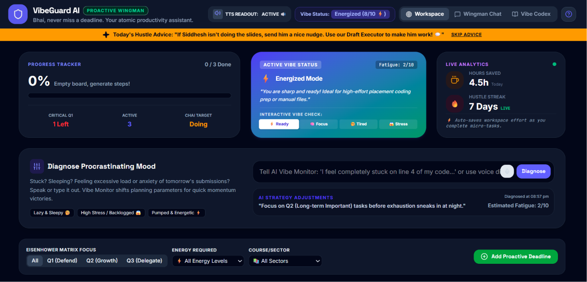
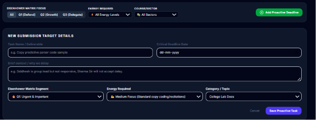
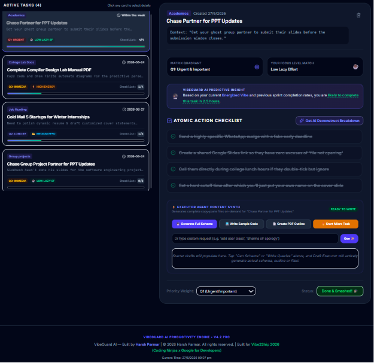
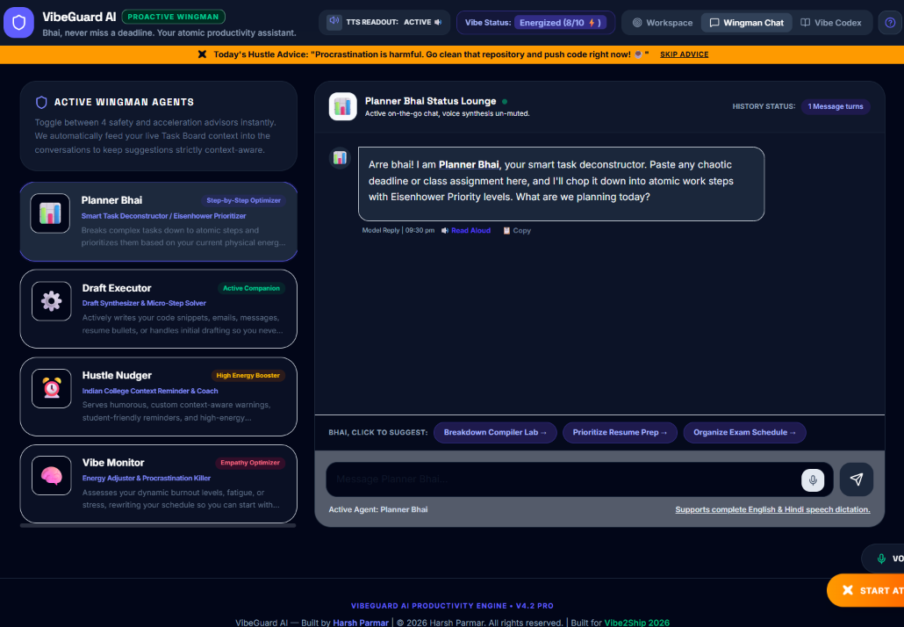
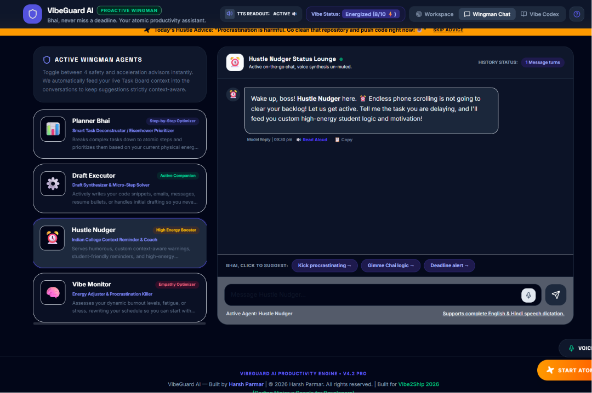
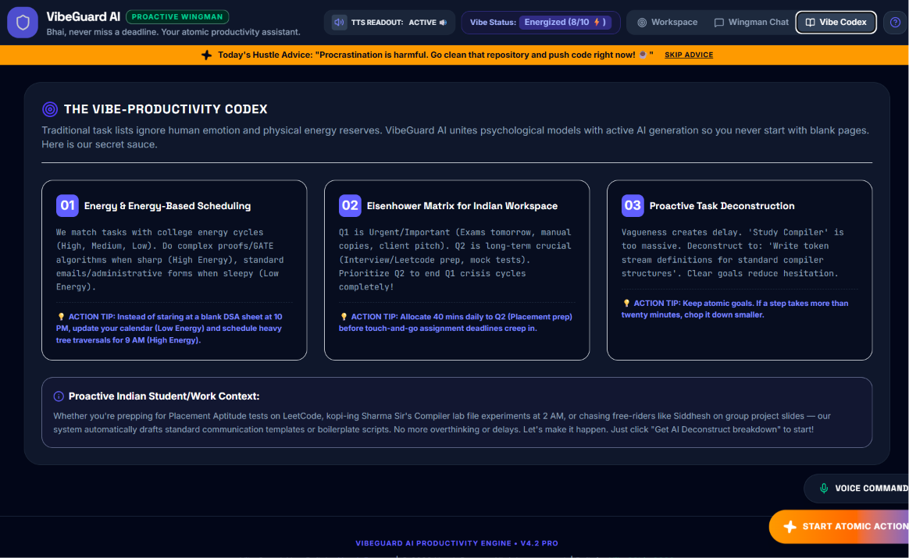

<div align="center">

# ⚡ VibeGuard AI
### *The Last-Minute Life Saver*

**An AI agent that doesn't just remind you — it helps you finish.**

[](https://vibeguard-ai-912952177005.asia-southeast1.run.app)
[](https://ai.google.dev/)
[](https://hack.codingninjas.com)
[](https://www.typescriptlang.org/)
[](https://cloud.google.com/run)

<br/>

> *"It's 11:47 PM. Submission closes at midnight. The cursor is blinking on an empty page.*
> *Every reminder app you open tells you what you already know.*
> *VibeGuard tells you what to do next — and then helps you do it."*

<br/>

**🏆 Built Solo · End-to-End · Deployed & Live · PS1 — The Last-Minute Life Saver**

</div>

---

## 📸 Screenshots

### 🖥️ Main Dashboard — Live Progress, Vibe Status & Hustle Advice



> *Live progress tracker, Active Vibe Status (Energized Mode), Hustle Advice banner, Eisenhower Matrix filter, and the Diagnose Procrastinating Mood panel — all in one view.*

---

### ➕ Add Proactive Deadline — Smart Task Creation



> *Create a task with deadline, brief context/reason for delay, Eisenhower Matrix segment, energy level required, and category — so the Planner Agent has everything it needs.*

---

### ✅ Active Tasks — Atomic Action Checklist + On-Demand Content Generation



> *Each task expands into an AI-generated atomic checklist. One-tap buttons — "Generate Mock PDF," "Create Design Draft," "Get AI Breakdown" — generate real content instantly.*

---

### ⏱️ Focused Sprint Mode


> *One tap to enter distraction-free Pomodoro sprint mode, synced live to the active task checklist.*

---

### 🤖 Wingman Chat — Planner Bhai



> *Direct conversation with Planner Bhai — paste any chaotic deadline or assignment and it deconstructs it into atomic steps with Eisenhower priority levels instantly.*

---

### 🔥 Wingman Chat — Hustle Nudger



> *Hustle Nudger takes over with high-energy, context-aware student motivation — not generic pings, but targeted logic built for Indian college/work pressure.*

---

### 📖 The Vibe-Productivity Codex



> *The three core principles behind every recommendation VibeGuard makes: Energy-Based Scheduling, Eisenhower Matrix for Indian workspace context, and Proactive Task Deconstruction.*

---

## 🎯 The Problem (That Everyone Has Lived)

Students and professionals don't miss deadlines because they're lazy.

They miss them because **existing tools are passive**. A calendar notification tells you the deadline exists. A to-do app shows you the list. A reminder pings you at the wrong time. None of them reduce the size of the task, tell you what to do first, or help you actually start.

**By the time it's "last minute," you're paralyzed — not unmotivated.**

VibeGuard was built to fix exactly that.

---

## 💡 The Solution

VibeGuard AI is a **proactive productivity web app** powered by four specialized AI agents, all running on Google's Gemini API.

You give it a task and a deadline. It gives you a plan, adapts to your energy, generates the content you need, and keeps you moving — **step by step, until it's done**.

```
You enter task + deadline
        ↓
Planner Agent breaks it into atomic steps
        ↓
Vibe Monitor adjusts priority to match your energy
        ↓
Executor Agent generates real content on demand
        ↓
Nudger Agent keeps you moving with context-aware motivation
        ↓
Task done. Deadline met.
```

---

## 🧠 The Four Agents

| Agent | What It Actually Does |
|---|---|
| 🧠 **Planner Agent** *("Planner Bhai")* | Deconstructs any task into ordered atomic steps using the Eisenhower Matrix. Re-structures the list every time your energy state changes. |
| ⚡ **Executor Agent** *("Draft Executor")* | Generates real, usable output on demand — SQL schemas, code snippets, email drafts, document outlines. Never a blank page. |
| 📊 **Vibe Monitor** | Reads your selected mood/energy state (Energized / Focused / Tired / Stressed) and continuously feeds it back into the Planner. The system adapts — not you. |
| 🔥 **Nudger Agent** *("Hustle Nudger")* | Delivers context-aware motivational nudges based on which step you're on and how you feel. Not "don't forget!" — actual targeted pushes. |

> **This is what "agentic" is supposed to mean** — independent agents collaborating to finish the job, not just describe it.

---

## ✨ Features

- **⚛️ Atomic Action Checklists** — every task becomes small, completable steps. Not one scary block of work.
- **⚡ On-Demand Content Generation** — *"Generate Schema Now," "Write Sample Code," "Create PDF Outline"* — real, usable output instantly.
- **⏱️ Focused Sprint Mode** — distraction-free Pomodoro timer synced live to your active checklist.
- **🎨 Vibe Check Selector** — tap your current energy. Watch the entire task board re-prioritize in real time.
- **🤖 Wingman Chat** — direct conversation with any of the four agents, each holding full context of your live task board.
- **📈 Predictive Time Estimates** — realistic time-to-completion based on task complexity + current energy.
- **🔥 Hustle Streak Tracker** — visible momentum dashboard showing hours saved and streak count.
- **💤 Power Nap Reminder** — built-in, guilt-free recovery break when you're running on empty.
- **🛡️ Resilient Backend** — auto-retry, model fallback, and offline-ready responses. It never breaks on you mid-sprint.

---

## 🛠️ Tech Stack

| Layer | Technology |
|---|---|
| Frontend | React + TypeScript (Vite) |
| Backend | Node.js + Express (TypeScript) |
| AI Engine | **Google Gemini API** (multi-agent orchestration) |
| Build & IDE | **Google AI Studio** |
| Deployment | **Google Cloud Run** |

### Google Technologies Used

- **Gemini API** — powers all four agents: planning, execution, vibe monitoring, and nudging
- **Google AI Studio** — used end-to-end for building, prompt engineering, and iterating the entire application
- **Google Cloud Run** — hosts the live, auto-scaling production deployment

---

## 🚀 Try It Live

**🌐 Live App:** [https://vibeguard-ai-912952177005.asia-southeast1.run.app](https://vibeguard-ai-912952177005.asia-southeast1.run.app)

### In 60 Seconds:
1. Open the live link above
2. Add a task + deadline using **"Add Proactive Deadline"**
3. Tap a mood on the **Vibe Check selector** — watch the task list re-prioritize instantly
4. Open a task → tap **"Start Atomic Action"** to enter Focused Sprint Mode

---

## 📦 Run Locally

```bash
# Clone the repo
git clone https://github.com/HarshParmar029/vibeguard-last-minute-lifesaver.git
cd vibeguard-last-minute-lifesaver

# Install dependencies
npm install

# Set up environment
cp .env.example .env
# Add your GEMINI_API_KEY in .env

# Start development server
npm run dev
```

### Environment Variables

```env
GEMINI_API_KEY=your_gemini_api_key_here
PORT=3000
```

---

## 📁 Project Structure

```
vibeguard-last-minute-lifesaver/
├── src/
│   ├── App.tsx          # Main application, UI, agent orchestration
│   ├── data.ts          # Task & agent data models
│   └── types.ts         # TypeScript type definitions
├── server.ts            # Express backend + Gemini API integration
├── docs/                # Screenshots
│   ├── img1_dashboard.png
│   ├── img2_add_task.png
│   ├── img3_active_tasks.png
│   ├── img4_sprint_btn.png
│   ├── img5_wingman_planner.png
│   ├── img6_wingman_nudger.png
│   └── img7_codex.png
├── index.html
├── vite.config.ts
├── tsconfig.json
├── package.json
└── .env.example
```

---

## 🏆 Hackathon Context

**Vibe2Ship 2026** — Coding Ninjas × Google for Developers

**Problem Statement Selected:** PS1 — *The Last-Minute Life Saver*
> "Build an AI-powered productivity companion that proactively assists users in planning, prioritizing, and completing tasks before deadlines are missed."

**Approach:** Four specialized Gemini-powered agents forming a closed-loop system. Not a chatbot around a to-do list — agents that plan, generate, adapt, and motivate in real time.


---

## 👤 Author

**Harsh Parmar**
B.Tech ICT · Marwadi University, Rajkot
[GitHub](https://github.com/HarshParmar029) · [Email](mailto:hp259369@gmail.com)

---

<div align="center">

*Built solo. Shipped end-to-end. From first prompt in Google AI Studio to live on Google Cloud Run.*

**⚡ VibeGuard AI — because the gap between knowing and doing is where deadlines die.**

</div>
